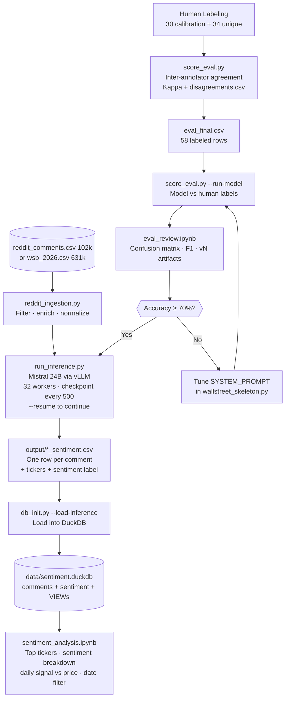

# The LLAMA of WallStreet — LLM Sentiment Pipeline

**Course:** Big Data Lab, BBS / CINECA Leonardo  
**Team:** Jovan, Alice, Sergio, Pierpaolo, Francesco  
**Repo:** `https://gitlab.hpc.cineca.it/jjezdic0/big_data_lab`

---

## What This Is

An end-to-end LLM sentiment pipeline that runs Mistral-Small-3.2-24B on Reddit comments to classify stock market sentiment. The pipeline:

1. **Evaluates** model accuracy against human annotators (58 labeled comments, 77.5% accuracy at v5)
2. **Runs inference** at scale — 133K WSB comments processed so far, full 631K run in progress on Leonardo
3. **Stores** all results in DuckDB — 230K comments, 56K relevant, 3K unique tickers
4. **Visualizes** daily sentiment intensity per ticker with stock price overlay

---

## Pipeline Workflow



---

## Repo Structure

```
llm/
├── wallstreet_skeleton.py       # LLM wrapper — SYSTEM_PROMPT v5 + analyze_comment()
├── reddit_ingestion.py          # Arctic Shift JSONL → normalized CSV (QUOTE_ALL)
├── run_inference.py             # Bulk inference: --input, --resume, 32 workers
├── db_init.py                   # DuckDB schema + migration (--load-inference, --status)
├── score_eval.py                # Eval: kappa, model eval, F1 report
├── prepare_eval.py              # Utility: assigns batches, prepares eval_final.csv
├── requirements.txt
│
├── sentiment_analysis.ipynb     # Viz notebook — DuckDB queries, date/source/subreddit filters
├── wallstreet_skeleton.ipynb    # Main pipeline notebook (run on Leonardo)
├── eval_review.ipynb            # Evaluation analysis notebook (run locally)
├── review_multi_company.ipynb   # Edge-case collection notebook (run on Leonardo)
│
├── data/
│   ├── wsb_2026.csv             # Arctic Shift WSB Jun 2026 (631K rows) — gitignored
│   └── sentiment.duckdb         # Generated DB — gitignored, recreate with db_init.py
│
├── output/                      # Generated inference CSVs — gitignored
│
├── config/
│   ├── LLM_start.job            # SLURM: starts Mistral on GPU node
│   ├── LLM_start_jupyter.job    # SLURM: starts Jupyter on CPU node
│   └── 1_env_config.sh
│
├── eval/
│   ├── instructions.txt
│   ├── calibration_<name>.csv / calibration_all.csv
│   ├── batch_<name>_labeled.csv
│   ├── eval_final.csv           # Ground truth: 58 rows
│   ├── disagreements.csv
│   ├── edge_cases_Alice.csv
│   ├── model_vs_labels.csv      # gitignored
│   └── v1–v5 *.png / *.csv      # Versioned evaluation artifacts
│
├── docs/
│   ├── CALIBRATION_NEXT_STEPS.md
│   └── PRODUCTION_READINESS.md
│
└── examples/
    ├── notebook_solution.py
    └── student_notebook_LLM.ipynb
```

---

## Current Database State

```
DuckDB: data/sentiment.duckdb
════════════════════════════════════════
Comments:      230,386
Sentiment:     230,386  (56,583 relevant)
Tickers:         3,087  unique
Date range: 2024-01-27 → 2026-06-04
════════════════════════════════════════
Sources:
  reddit_comments  — 96,406 rows  (Jan 2024 → Apr 2025)
  arctic_shift     — 133,980 rows (Jun 2026, partial — full 631K run in progress)
```

---

## Eval Results

Model: `mistralai/Mistral-Small-3.2-24B-Instruct-2506` on 58 labeled comments.

| Version | Accuracy | Neg. F1 | Very Neg. Recall | Very Neg. F1 | is_relevant |
|---------|----------|---------|------------------|--------------|-------------|
| v1 (baseline) | 40% | 0.60 | 8% (1/13) | 0.13 | 72% |
| v2 (prompt tuned) | 60% | 0.75 | 8% (1/13) | 0.13 | 97% |
| v3 (few-shot + expanded rules) | 69% | 0.77 | 69% (9/13) | 0.60 | 98% |
| **v5 (corrected ground truth)** | **77.5%** | — | — | — | **98%** |

**Sentiment severity scale:**

| Level | Investor signal |
|-------|----------------|
| `very negative` | Existential: fraud, NLRB violations, food safety crisis, bankruptcy risk |
| `negative` | Real brand/financial damage: price gouging, product failures, competitor wins |
| `neutral` | Minor gripes with no investor impact |
| `positive` | Favorable: buybacks, earnings beats, positive customer experience |
| `very positive` | Transformative: blowout earnings, major acquisitions |

---

## Running on Leonardo

### Prerequisites

```bash
module load python/3.11.7
python3 -m venv .venv
source .venv/bin/activate
pip install langchain-openai pandas scikit-learn duckdb tqdm
```

### Every session

**Step 1 — Start the LLM model job**
```bash
sbatch config/LLM_start.job
squeue --me -i 5        # wait for R status, then Ctrl+C
cat llm_launcher_small-*.out | grep "ssh -L"
```

**Step 2 — Run full inference**
```bash
source .venv/bin/activate
python run_inference.py --input data/wsb_2026.csv            # first run
python run_inference.py --input data/wsb_2026.csv --resume   # resume after interruption
```

**Step 3 — SSH tunnels** (open on your laptop to access LLM + Jupyter)
```bash
ssh -L 8000:<llm_ip>:8000 jjezdic0@login02-ext.leonardo.cineca.it -N
```

**Step 4 — Download output + load into DuckDB** (run locally)
```bash
scp jjezdic0@login02-ext.leonardo.cineca.it:.../output/wsb_2026_sentiment.csv output/

python db_init.py --load-inference output/wsb_2026_sentiment.csv --source arctic_shift
python db_init.py --status
```

### Upload data to Leonardo

```bash
scp data/wsb_2026.csv jjezdic0@login02-ext.leonardo.cineca.it:/leonardo/home/userexternal/jjezdic0/jjezdic0/project/big_data_lab/data/wsb_2026.csv
```

---

## Running Locally

```bash
git clone https://gitlab.hpc.cineca.it/jjezdic0/big_data_lab.git
cd big_data_lab
pip install pandas scikit-learn jupyter matplotlib seaborn duckdb yfinance

# Rebuild DuckDB from inference outputs
python db_init.py --load-inference output/reddit_sentiment_first_fullrun.csv --source reddit_comments
python db_init.py --load-inference output/wsb_2026_sentiment.csv --source arctic_shift

# Eval charts
jupyter notebook eval_review.ipynb

# Sentiment visualization
jupyter notebook sentiment_analysis.ipynb
# Set DATE_FROM / DATE_TO / FILTER_SOURCES / FILTER_SUBREDDITS in cell 02
```

---

## Roadmap

### In Progress
- **Full 631K WSB inference** — running on Leonardo (~2.7h at 64 it/s). Will extend data to Jun 21 2026 and add ~498K more comments.

### Next — `feat/production-pipeline`
- **`praw_scraper.py`** — PRAW daily fetch for r/wallstreetbets, r/investing, r/stocks → same CSV format as `reddit_ingestion.py` output
- **SLURM daily scheduler** — chains: scrape → `run_inference.py` → `db_init.py --load-inference` → appends to DuckDB
- **`dashboard.py`** — Streamlit interactive dashboard with Plotly charts, date range slider, subreddit/source multi-select filter

### Future
- Per-ticker alert system: notify when weighted sentiment signal crosses threshold
- Backtest: correlate sentiment signal with next-day price movement
- Expand subreddits (r/options, r/pennystocks, r/investing)

---

## Pushing Updates

```bash
git add <files>
git commit -m "your message"
git push
```

> **CINECA note:** After June 24 2026 maintenance, repo URLs will change. Check HPC-NEWS before pushing.
