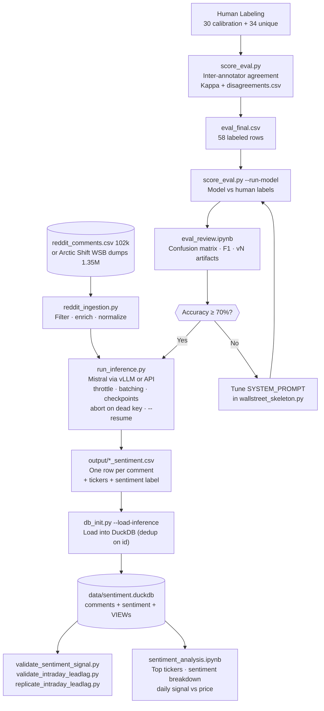

# The LLAMA of WallStreet — LLM Sentiment Pipeline

**Course:** Big Data Lab, BBS / CINECA Leonardo
**Team:** Jovan, Alice, Sergio, Pierpaolo, Francesco
**Repo:** `https://github.com/JTheSwipa/wallstreet_sentiment`

---

## What This Is

An end-to-end LLM sentiment pipeline that classifies stock-market sentiment in Reddit comments, plus a validation study of whether that sentiment relates to actual price moves. The pipeline:

1. **Evaluates** model accuracy against human annotators (58 labeled comments, 77.5% accuracy at prompt v5)
2. **Runs inference** at scale — 579,692 comments scored (Mistral-Small-24B on HPC, then `mistral-small-2506` via API after HPC access ended)
3. **Stores** results in DuckDB — 1.44M comments ingested, 144K scored as market-relevant, 4,705 unique tickers
4. **Validates** the signal against market data — daily and intraday price/volume joins (see findings below)

**Started** as an HPC course project running vLLM on CINECA Leonardo; **now** pivoting toward a WSB attention/mood tracker on the `pivot/trader-sentiment-mvp` branch (architecture per `docs/PIVOT_TRADER_MVP_COUNCIL_VERDICT.md`).

---

## Key Findings (validation study)

Full analysis: `docs/SENTIMENT_PRICE_VALIDATION.md`.

- **No next-day predictive signal.** Daily per-ticker sentiment does not predict next-day returns in either corpus (r ≈ 0 across pooled and per-day cross-sectional tests). An apparently significant hit rate decomposes into a majority-class artifact.
- **The reactive signal is real — and WSB-specific.** WSB sentiment tracks the move that already happened that day (r = +0.21, p < 0.0001), and comment volume tracks abnormal trading volume. The r/news corpus is price-insensitive and uniformly negative.
- **Intraday information lead, replicated.** Within-day sentiment shifts correlate with returns 90–120 minutes later. A pre-registered out-of-sample replication (June 4–12: 1,280 buckets, 33 tickers) passed at both registered lags (k=+3: mean r = +0.216, p < 0.0001; k=+4: +0.188, p = 0.0002); tercile spread ≈ 0.56% per 90 min **before costs** — an information lead, not a trading strategy. A held-out confirmation set (June 15–19) is scored and analyzed separately after 2026-07-31.

---

## Pipeline Workflow



---

## Repo Structure

```
├── wallstreet_skeleton.py         # LLM wrapper — SYSTEM_PROMPT v5, throttle, backoff, batch mode
├── reddit_ingestion.py            # Arctic Shift JSONL → normalized CSV (QUOTE_ALL)
├── run_inference.py               # Bulk inference: --resume, --batch, --max-consecutive-errors
├── db_init.py                     # DuckDB schema + loaders (--load-inference, --status)
├── score_eval.py                  # Eval: kappa, model eval, F1 report
├── prepare_eval.py                # Utility: assigns batches, prepares eval_final.csv
│
├── validate_sentiment_signal.py   # Daily sentiment ↔ price/volume validation
├── validate_intraday_leadlag.py   # 30-min lead-lag pilot (June 1–3)
├── replicate_intraday_leadlag.py  # Pre-registered replication + --holdout mode
├── cache_intraday.py              # Cache 30m/15m candles before yfinance's 60-day window closes
├── consistency_check.py           # Model self-consistency spot checks
│
├── sentiment_analysis.ipynb       # Viz notebook — DuckDB queries + filters
├── eval_review.ipynb              # Evaluation analysis notebook
├── wallstreet_skeleton.ipynb      # Original HPC pipeline notebook (Leonardo era)
├── review_multi_company.ipynb     # Edge-case collection notebook (Leonardo era)
│
├── .github/workflows/
│   └── score-june.yml             # (main branch) Cron-chained June scoring vs Mistral API
│
├── data/                          # gitignored — DuckDB + raw CSVs + candle cache
├── output/                        # gitignored — generated inference CSVs
│
├── config/                        # SLURM job files (Leonardo era)
├── eval/                          # Labeled batches, ground truth, v1–v5 eval artifacts
├── presentation/                  # Charts + presentation brief
├── docs/
│   ├── SENTIMENT_PRICE_VALIDATION.md    # Validation study (pre-registration + results)
│   ├── PIVOT_TRADER_MVP_COUNCIL_VERDICT.md  # MVP architecture review
│   ├── PROMPT_HISTORY.md / V4_PROMPT_DESIGN.md
│   ├── CALIBRATION_NEXT_STEPS.md
│   └── PRODUCTION_READINESS.md
└── examples/                      # Course scaffolding
```

---

## Current Database State

```
DuckDB: data/sentiment.duckdb (gitignored — rebuild via db_init.py)
════════════════════════════════════════════════
Comments ingested:  1,443,717
Comments scored:      579,692  (144,021 relevant)
Unique tickers:         4,705
════════════════════════════════════════════════
Sources:
  reddit_comments — 96,406 rows   (r/news, Jan 2024 → Apr 2025, fully scored)
  arctic_shift    — 1,347,311 rows (r/wallstreetbets, May 1 → Jun 21 2026)
Scored coverage:  through Jun 15 2026 (June 15–21 + May backlog pending)
```

Scoring state: the June backlog run hit the Mistral free-tier monthly quota on 2026-07-07 at 350,844/498,565 rows. The GitHub Actions workflow (`score-june.yml`, main branch) is disabled until the quota resets on 2026-07-31; ~148K June rows remain. The May 2026 backlog (~716K rows) is unscored.

---

## Eval Results

Model: `mistralai/Mistral-Small-3.2-24B-Instruct-2506` on 58 labeled comments.

| Version | Accuracy | Neg. F1 | Very Neg. Recall | Very Neg. F1 | is_relevant |
|---------|----------|---------|------------------|--------------|-------------|
| v1 (baseline) | 40% | 0.60 | 8% (1/13) | 0.13 | 72% |
| v2 (prompt tuned) | 60% | 0.75 | 8% (1/13) | 0.13 | 97% |
| v3 (few-shot + expanded rules) | 69% | 0.77 | 69% (9/13) | 0.60 | 98% |
| **v5 (corrected ground truth)** | **77.5%** | — | — | — | **98%** |

**Sentiment severity scale:**

| Level | Investor signal |
|-------|----------------|
| `very negative` | Existential: fraud, NLRB violations, food safety crisis, bankruptcy risk |
| `negative` | Real brand/financial damage: price gouging, product failures, competitor wins |
| `neutral` | Minor gripes with no investor impact |
| `positive` | Favorable: buybacks, earnings beats, positive customer experience |
| `very positive` | Transformative: blowout earnings, major acquisitions |

---

## Running Locally

```bash
git clone https://github.com/JTheSwipa/wallstreet_sentiment.git
cd wallstreet_sentiment
pip install -r requirements.txt

# Rebuild DuckDB from inference outputs
python db_init.py --load-inference output/<run>_sentiment.csv --source arctic_shift
python db_init.py --status

# Validation study (needs network for yfinance)
python validate_sentiment_signal.py

# Notebooks
jupyter notebook eval_review.ipynb          # eval charts
jupyter notebook sentiment_analysis.ipynb   # sentiment visualization
```

### Scoring new comments via the Mistral API

```bash
export VLLM_ENDPOINT=https://api.mistral.ai/v1
export VLLM_MODEL=mistral-small-2506
export VLLM_API_KEY=<your key>
export LLM_RPS=1        # free-tier pacing: 1 request/second across all workers

python run_inference.py --input data/<file>.csv --workers 16 --resume
```

`run_inference.py` checkpoints every 2,000 rows, retries 429s with backoff, retries errored rows on `--resume`, and aborts (exit 1, checkpoint preserved, no final output) after 30 consecutive failed requests so a dead API key can never produce a false-complete result.

At scale, scoring runs as a cron-chained GitHub Actions workflow (`.github/workflows/score-june.yml` on `main`): each run scores for up to 5.5 h against the release-hosted input, uploads a checkpoint artifact, and the chain self-disables when the file completes.

### Intraday candles — cache before the window closes

yfinance serves 30-minute candles only ~60 days back. `data/cache/candles_30m.csv` (May 25 – Jul 3 2026, 1,297 tickers) is the validated cache behind the intraday analyses — **never refetch it**; June disappears from yfinance in early August 2026. `cache_intraday.py` documents the fetch.

---

## Running on Leonardo (historical)

The original pipeline ran Mistral-Small-3.2-24B under vLLM on CINECA Leonardo GPU nodes (`config/LLM_start.job`, SLURM). Access ended in late June 2026; the config and job files are kept for reproducibility of the course setup:

```bash
sbatch config/LLM_start.job
squeue --me -i 5                          # wait for R status
ssh -L 8000:<llm_ip>:8000 <cineca_user>@login02-ext.leonardo.cineca.it -N
python run_inference.py --input data/wsb_2026.csv --resume
```

---

## Roadmap

### Blocked until 2026-07-31 (Mistral quota reset)
- Finish the June backlog (~148K rows): re-enable `score-june.yml`
- **Held-out confirmation** of the intraday lead-lag on June 15–19 (`replicate_intraday_leadlag.py --holdout`) — pre-committed, reported separately from the primary replication

### Team decisions pending
- **Framing:** WSB attention/mood tracker vs. "sentiment leads price by ~2h" research claim (see `docs/SENTIMENT_PRICE_VALIDATION.md`, verdict section)
- **May backlog** (~716K rows ≈ 2 months of free quota or ~$200 paid): score with the teacher model, or wait for a distilled student

### MVP (per council verdict)
- Distill the teacher labels into a small classifier for free ongoing inference
- Supabase serving layer (aggregates only, with `subreddit` column) + static React frontend — no Streamlit, no custom backend
- Honest-disclosure UI: every sentiment number ships with n, eval accuracy, and the "reactive, not predictive" caveat
