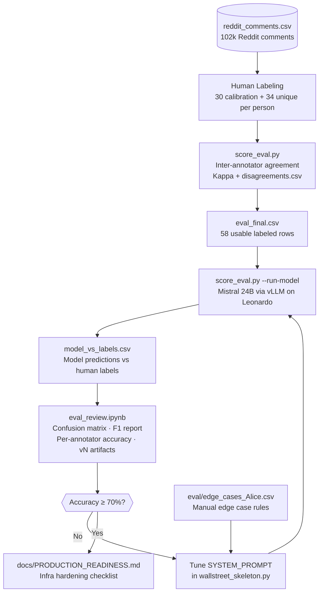

# The LLAMA of WallStreet — LLM Sentiment Pipeline

**Course:** Big Data Lab, BBS / CINECA Leonardo  
**Team:** Jovan, Alice, Sergio, Pierpaolo, Francesco  
**Repo:** `https://gitlab.hpc.cineca.it/jjezdic0/big_data_lab`

---

## What This Is

An LLM evaluation pipeline that runs Mistral-Small-3.2-24B on 102k Reddit comments to classify stock market sentiment. The pipeline measures how well the model agrees with 5 human annotators across a 5-level sentiment scale.

---

## Pipeline Workflow



---

## Repo Structure

```
llm/
├── wallstreet_skeleton.py       # LLM wrapper — SYSTEM_PROMPT + analyze_comment()
├── score_eval.py                # Main eval script: kappa, model eval, F1 report
├── prepare_eval.py              # Utility: assigns batches, prepares eval_final.csv
├── requirements.txt
│
├── wallstreet_skeleton.ipynb    # Main pipeline notebook (run on Leonardo)
├── eval_review.ipynb            # Analysis notebook (run locally)
├── review_multi_company.ipynb   # Edge-case collection notebook (run on Leonardo)
│
├── config/
│   ├── LLM_start.job            # SLURM: starts Mistral model on GPU node
│   ├── LLM_start_jupyter.job    # SLURM: starts Jupyter on CPU node
│   └── 1_env_config.sh
│
├── eval/
│   ├── instructions.txt         # Labeling guide for annotators
│   ├── calibration_<name>.csv   # 30 shared calibration comments per person
│   ├── calibration_all.csv      # Merged calibration set
│   ├── batch_<name>_labeled.csv # 34 unique labeled comments per person
│   ├── eval_final.csv           # Ground truth: 58 rows after merge
│   ├── disagreements.csv        # Calibration rows with highest disagreement
│   ├── edge_cases_Alice.csv     # Manual edge cases + classification rules
│   ├── model_vs_labels.csv      # Last model run predictions (gitignored)
│   ├── v1_*.png / v2_*.png      # Versioned evaluation charts
│   └── v1_*.csv / v2_*.csv      # Versioned classification reports
│
├── docs/
│   ├── CALIBRATION_NEXT_STEPS.md  # Labeling guide and calibration process
│   └── PRODUCTION_READINESS.md    # Infra checklist for when accuracy ≥ 70%
│
└── examples/
    ├── notebook_solution.py        # Reference LLM wrapper implementation
    └── student_notebook_LLM.ipynb  # Original assignment notebook
```

---

## Eval Results

Model: `mistralai/Mistral-Small-3.2-24B-Instruct-2506` on 58 labeled comments.

| Version | Accuracy | Negative F1 | Very Neg. Recall | is_relevant |
|---------|----------|-------------|------------------|-------------|
| v1 (baseline) | 40% | 0.60 | 0.08 | 72% |
| v2 (prompt tuned) | **60%** | **0.75** | 0.08 | **97%** |

**Per-annotator agreement with model (v2):**

| Annotator | Accuracy |
|-----------|----------|
| Pierpaolo | 60% |
| Francesco | 50% |
| Jovan | 42% |
| Sergio | 22% |
| Alice | 0% |

Alice and Sergio's low scores are **not annotator error** — their batches concentrated on `very negative` comments, which the model still rarely predicts (recall 0.08). This is the main remaining model bug.

**Sentiment severity scale** — severity maps to investor impact, not general emotional tone:

| Level | Investor signal |
|-------|----------------|
| `very negative` | Existential: fraud, NLRB violations, food safety crisis, bankruptcy risk |
| `negative` | Real brand/financial damage: price gouging, product failures, competitor wins |
| `neutral` | Minor gripes with no investor impact: packaging complaints, macro framing |
| `positive` | Favorable: buybacks, earnings beats, positive customer experience |
| `very positive` | Transformative: blowout earnings, major acquisitions |

---

## Running on Leonardo

### Prerequisites

```bash
# One-time: set up venv (if not already done)
module load python/3.11.7
python3 -m venv .venv
source .venv/bin/activate
pip install langchain-openai pandas scikit-learn

# One-time: symlink the data file from scratch
ln -s /leonardo_scratch/fast/tra26_bbs/jjezdic0/hpc_bbs_26/team_project/llm/reddit_comments.csv ~/project/big_data_lab/reddit_comments.csv
```

### Every session

**Step 1 — Start the LLM model job**
```bash
sbatch config/LLM_start.job
squeue --me -i 5        # wait for R status, then Ctrl+C
cat llm_launcher_small-*.out | grep "ssh -L"
```
Copy the IP from the output (e.g. `10.5.1.76`).

**Step 2 — Start Jupyter** (only needed to run notebooks)
```bash
sbatch config/LLM_start_jupyter.job
squeue --me -i 5
cat jupyter-*.out       # copy the tunnel command and URL
```

**Step 3 — Open SSH tunnels on your laptop** (two terminal windows)
```bash
# Terminal 1 — LLM tunnel
ssh -L 8000:<llm_ip>:8000 jjezdic0@login02-ext.leonardo.cineca.it -N

# Terminal 2 — Jupyter tunnel (copy exact command from jupyter-*.out)
ssh -L <port>:<node_ip>:<port> jjezdic0@login02-ext.leonardo.cineca.it -N
```

> **Note:** `.out` files are written to whichever directory you ran `sbatch` from — always `cat` them from `~/project/big_data_lab/`.

**Step 4 — Run the model eval**
```bash
source .venv/bin/activate
export VLLM_ENDPOINT="http://<llm_ip>:8000/v1"
export VLLM_API_KEY="password"
python3 -u score_eval.py --run-model | tee eval/score_report_$(date +%Y%m%d).txt
```

> The IP changes every time you resubmit `LLM_start.job` — always check the `.out` file.

---

## Running Locally

```bash
git clone https://gitlab.hpc.cineca.it/jjezdic0/big_data_lab.git
cd big_data_lab
pip install pandas scikit-learn jupyter matplotlib seaborn

# Kappa + disagreement analysis (no LLM needed)
python3 score_eval.py

# Eval charts — open eval_review.ipynb, set VERSION = 'v1' or 'v2', run all cells
jupyter notebook eval_review.ipynb
```

---

## Next Steps

1. **Fix `very negative` recall** — add 2–3 few-shot examples to `SYSTEM_PROMPT` in `wallstreet_skeleton.py` (NLRB violation, food safety, executive misconduct). This is the only remaining major bug.
2. **Team calibration** — 25 calibration disagreements, all Kappa < 0.2. Align on `very negative` threshold before re-labeling.
3. **Re-run eval** → generate v3 artifacts in `eval_review.ipynb` with `VERSION = 'v3'`.
4. **Production** → follow `docs/PRODUCTION_READINESS.md` once accuracy ≥ 70%.

---

## Pushing Updates

Use your CINECA username and Personal Access Token (not your Leonardo password):

```bash
git add eval/model_vs_labels.csv
git commit -m "add model eval results"
git push
```
